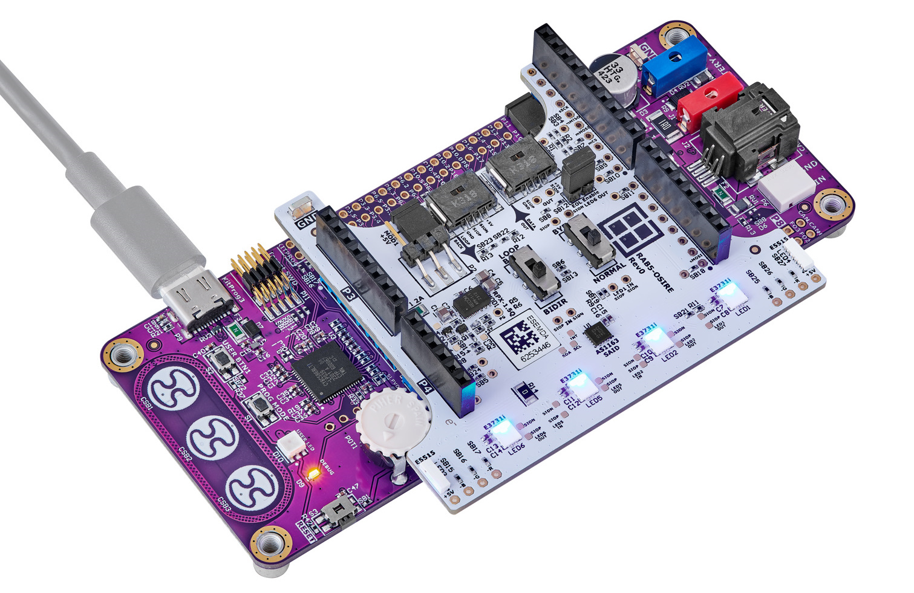

# RAB5-OSIRE and RGBi-GUI-MicroController Project

**NOTE:**  The current up to 100 mA may flow from the System Basis Chip [U1] TLE9262-3BQXV33 VCC2 LDO Ouput. In case more current is needed, please use RDK4 BATTERY supply terminals J1 and J4 and switch to RECOM RPX-1.5Q power supply on RAB5-OSIRE board [Switch the jumper from pins 2 and 3 to pins 1 and 2 on the P2 port]. This would increase the current limit to 1.5A.

## Requirements

- [ModusToolbox™ software](https://www.cypress.com/products/modustoolbox-software-environment) v3.2
- [RDK4 Rev2.](https://www.rutronik24.com/product/rutronik/rdk4/20820197.html)
- [AppNote OSIRE® E3731i](https://ams-osram.com/products/multi-chips/multi-color-leds/osram-osire-e3731i-krtbi-d2lm31-31)

## Software and hardware on request

For any software or hardware that is listed below please get in touch with solutions@rutronik.com

- The ams OSIRE® E3731i LED stripe with 20 LEDs on it. RUTRONIK Part No.: [LEDATV3196](https://www.rutronik24.com/product/ams_osram/osire_e3731i_ledstripe/22814309.html)
- The ams OSRAM software "RGB-GUI-Microcontroller".
- The source code for the colour correction algorithms.

## Using the code example

Create the project and open it using one of the following:

<b>In Eclipse IDE for ModusToolbox&trade; software</b>

1. Click the **New Application** link in the **Quick Panel** (or, use **File** > **New** > **ModusToolbox&trade; Application**). This launches the [Project Creator](https://www.infineon.com/ModusToolboxProjectCreator) tool.

2. Pick a RDK4 kit supported by the code example from the PSoC&trade; 4 BSPs list shown in the **Project Creator - Choose Board Support Package (BSP)** dialogue.

   When you select a supported kit, the example is reconfigured automatically to work with the kit. To work with a different supported kit later, use the [Library Manager](https://www.infineon.com/ModusToolboxLibraryManager) to choose the BSP for the supported kit. You can use the Library Manager to select or update the BSP and firmware libraries used in this application. To access the Library Manager, click the link from the **Quick Panel**.

   You can also just start the application creation process again and select a different kit.

   If you want to use the application for a kit not listed here, you may need to update the source files. If the kit does not have the required resources, the application may not work.

3. In the **Project Creator - Select Application** dialogue, choose the RDK4_OSIRE_DEMO example in the Peripherals category by enabling the checkbox.

4. (Optional) Change the suggested **New Application Name**.

5. The **Application(s) Root Path** defaults to the Eclipse workspace which is usually the desired location for the application. If you want to store the application in a different location, you can change the *Application(s) Root Path* value. Applications that share libraries should be in the same root path.

6. Click **Create** to complete the application creation process.

For more details, see the [Eclipse IDE for ModusToolbox&trade; software user guide](https://www.infineon.com/MTBEclipseIDEUserGuide) (locally available at *{ModusToolbox&trade; software install directory}/docs_{version}/mt_ide_user_guide.pdf*).

### Operation

#### The ams OSRAM RGBi-GUI-MicroController software

The firmware example uses KitProg3 UART to connect with ams OSRAM RGBi-GUI-MicroController software. Additionally, it has stand-alone modes that enable the control and demonstration of OSIRE LEDs. 

- Connect the LED Stripe to the RDK4 as it is shown in a picture at the top of this document.

- Connect the PC to your RDK’s USB KitProg3 terminal.

- Programm the firmware.

- All the detected LEDs will start changing colours – it is a default startup mode.

- Load the ams OSRAM RGBi-GUI-MicroController software.

  

  

- Select the COM Port where the RDK4 KitProg3 is connected.

  

- Start working with LEDs from the first **INIT_DIR** command. If you need to set all the LEDs at once, please set the address to 0 – it is the broadcasting address. 

  

If you wish to use the demo without PC software, you may use the embedded example modes. The modes are switched using the CapSence buttons CSB1 and CSB3. NOTE: CapSense Buttons are sensitive, please be accurate while touching them.  

- By default, the „MinimalRGB“ demo is always engaged from the startup.
- Touch the CSB1 once and you will get into „ColorCorrectionStripe“ mode. The USER LED on the RDK4 will start blinking in YELLOW. From this point, the user needs to decide if he needs to read all the OTP memory from every OSIRE LED and store it in the microcontroller memory or not. If you are running this demo for the first time – this is necessary. So to do that please touch the CSB3 button gently and wait until the USER LED starts blinking in GREEN. Press the CSB1 now and the demo will start. If the memory has been saved previously, you only need to keep pressing the CSB1 and you will get to this mode finally.
- If you touch the CSB1 further – you will get into the „RunningLights“ mode. You will see how the stripe is changing the colours sequentially for every LED, they are updated once per 10 milliseconds. 
- By touching and holding the CSB1 will get you back to the „MinimalRGB“ demo.

#### The Python Scripts

The RAB5-OSIRE may be controlled with the RDK4 using a Python script that sends commands via KitProg3 UART. The RDK4 translates these commands into the OSP2.0 protocol and sends them to the SAID and OSIRE devices connected to the SIO interface.

How to run with RDK4 Rev2 in Windows:

- Program this code example to your RDK4 Rev2.
- Install the [Python](https://www.python.org/downloads/).
- Open the command prompt (administrator rights might be needed).
- Go to your .py files directory, for example, *cd C:\Users\GDR\mtw\RDK4_REV2_RAB5-OSIRE_DEMO\pyscripts* and run the script: *python .\ RDK4_testing.py*

### Debugging

If you successfully imported the example, the debug configurations are already prepared to use with the onboard debugger KitProg3. Open the ModusToolbox™ perspective and find the Quick Panel. Click on the debug launch configuration and wait for the programming to complete and the debugging process to start.

## Legal Disclaimer

The evaluation board including the software is for testing purposes only and, because it has limited functions and limited resilience, is not suitable for permanent use under real conditions. If the evaluation board is nevertheless used under real conditions, this is done at one’s responsibility; any liability of Rutronik is insofar excluded. 

