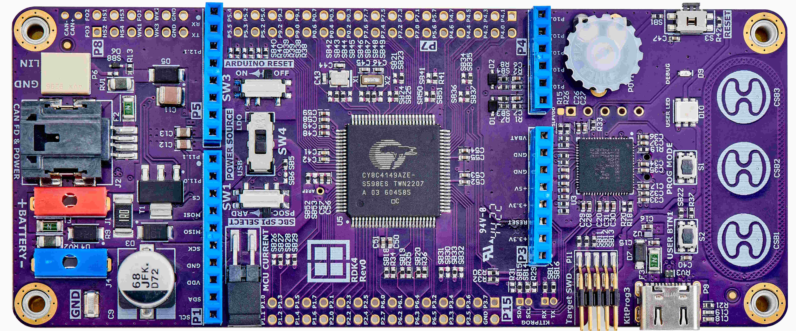

# RDK4 Rev2 BSP

## Overview

The development kit RDK4 is based on an automotive PSoC 4100S Max microcontroller and TLE9262-3BQX System-Basis-Chip. The RDK4 is a solution created by Rutronik that enables developers to evaluate and implement their ideas into their automotive or industrial projects.

## Features

-  CY8C4149AZE-S598 – Infineon’s Arm® Cortex™-M0+ AEC-Q100 compliant MCU.

-  All CY8C4149AZE-S598 GPIOs are accessible via onboard headers.

-  TLE9262-3BQXV33 - Infineon’s System Basis Chip for automotive applications.

-  On-board debugger KitProg3 with I2C and UART USB bridge.

- 10-pin Amphenol ICC SWD header for J-Link. 

-  JAE USB Type-C connector for the KitProg3 debugger.

-  Minitek MicroSpace™ CAN FD connector.

-  On-board capacitive buttons based on CapSense® CSX technology.

-  TOPLED® E1608 and OSIRE® E3635 OSRAM LEDs.

-  Diodes Inc. automotive PNP Power Transistor BCP5216TA for the SBC LDO circuit.

-  Keystone Electronics Corp. P/N5019 GND test point.

-  TOSHIBA Load Switch (with the current limiting capability) TCK22946G,LF.

-  NISSHINBO low power amplifier NJU77001F.

-  DIPTRONICS tactile buttons.

-  Panasonic Right-angled RESET switch.

-  C&K Slider switches for power supply selection and hardware configuration.

-  PIHER Potentiometer for ADC peripheral evaluation.

-  Passive components from Samsung EM, Yageo, and ASJ.

  

## Legal Disclaimer

The evaluation board including the software is for testing purposes only and, because it has limited functions and limited resilience, is not suitable for permanent use under real conditions. If the evaluation board is nevertheless used under real conditions, this is done at one’s responsibility; any liability of Rutronik is insofar excluded. 

